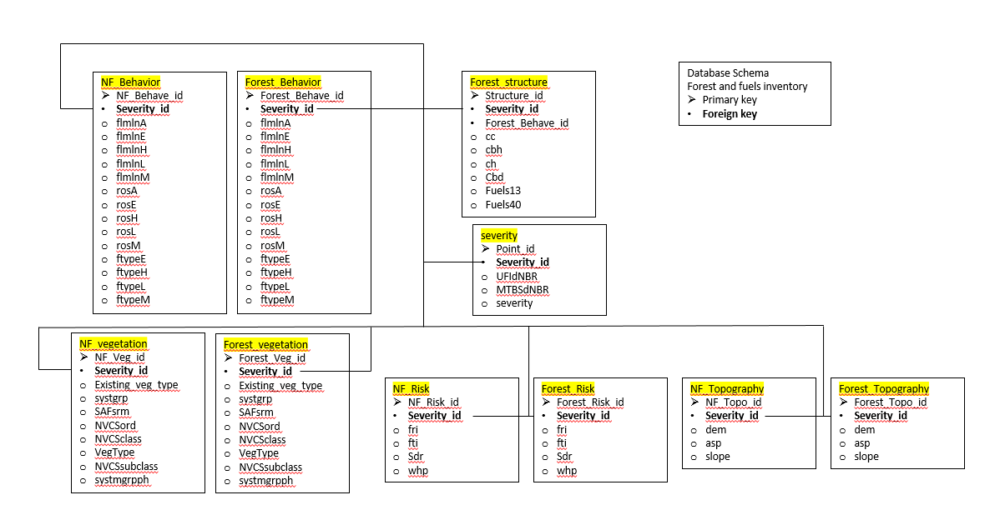

# Data description and database structure {#data}

Forest strcuture and fuels data are needed to model fire behavior and predict burn severity spatially. 

```{r fig, echo=FALSE, fig.align='center', crop=NULL}

```
Figure 1: databse structure for forest and fuels inventory.

This database structure is compatible with tree and stand level forest simulation software such as the Forest Vegetation Simulator (FVS) which can be used to model forest structure over time. An advantage of this approach and structure is these data allow detailed simulation of mortality during fire. 

Tree level data are related to plot polygons that allow for stand-level simulation. Fuels data is required for modeled fire behavior, such as flame length, rate or spread or fire type (surface, passive or active).

Whether or not these tables become populated remains to be seen- a disadvantage of this approach is that fuel reduction treatments are not readily applied to the landscape in question. It is also only useable for fire behavior modeling as an ArcMap toolbar extension. 